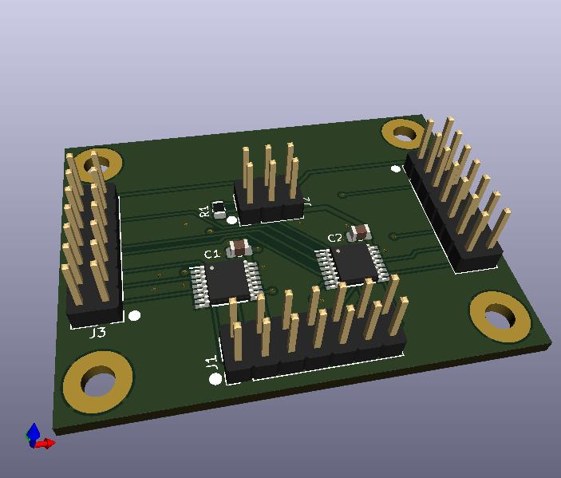

User IO Port Switch

Uses 14 pin headers to ribbon cables or USB adapters(see parent directory) or ribbon cables to USB adapters.

Middle bottom connector is input.

With middle connector at bottom, left is port A, right is port B

Port A is selected when Pin 2 on J2 is Low. (If R1 is not fitted, Pin 2 is low from pull-down on switch ICs)

Port B is selected when Pin 2 on J2 is high. (If R1 is fitted, Pin 2 will be pulled high by default.)

Pin 1 on J2 is Ground

Pin 3 and 5 on J2 are Vbus from Input.

Pin 4 is Vbus out to Port A

Pin 6 is Vbus out to Port B

These are not connected by default and must be jumpered or switched if connected devices need Vbus power.

BOM:

C1 C2: 1uF-10uF bypass(MLCC), be sure to check DC Bias derating.

R1: 4.7K Optional to default to Port B(Pin 2 pulled high) and can pull to ground from Pin 1 for Port A

J1, J3, J4: 2x07, 14 pin, 0.100 Headers(or sockets) AMP: 77313-818-14LF Samtec: TSW-107-07-F-D or similar

J2: 2x03, 6 pin, 0.100 Header. AMP: 77313-818-06LF,  Samtec: TSW-103-07-F-D

IC1, IC2: Texas Instruments: SN3257QPWRQ1 TSSOP-16 Package; 2:1 (SPDT) 4-Channel Switch with 1.8 V Logic

